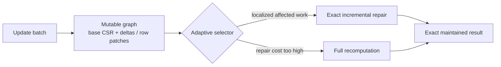

# VeloGraphX

[](https://github.com/sauravsingla/VeloGraphX/actions/workflows/ci.yml)
[](CMakeLists.txt)
[](CITATION.cff)
[](LICENSE)
[](CITATION.cff)

**Exact dynamic graph analytics in C++20.**

> **Maintain exact graph analytics as your graph changes — without blindly recomputing everything.**

VeloGraphX is a high-performance CPU engine for analytics on evolving graphs. It combines mutable graph storage, localized incremental repair, and adaptive fallback to full recomputation when repair becomes more expensive.

**2,000,000 updates · 0 BFS mismatches · 0 triangle mismatches**  
**Adaptive repair/recompute · Multicore CPU · Storage-independent algorithms · Reproducible benchmarks**  
**29 CTest targets · Linux/macOS CI · ASan/UBSan · Python interoperability**

## Why VeloGraphX?

- **Exact, not approximate:** maintained results are correctness-gated against fresh recomputation.
- **Adaptive execution:** repair only the affected work when that is cheaper; recompute when it is not.
- **Built for changing graphs:** mutable storage, batching, consolidation and dynamic algorithm paths are first-class concerns.
- **Systems-oriented:** multicore execution, SIMD intersections, NUMA-aware policies, compression, partition caching and asynchronous loading.
- **Auditable performance:** pinned competitors and datasets, raw samples, retained artifacts, correctness gates and negative results.

## Results at a glance

> GitHub-hosted numbers are **reproducible engineering evidence, not publication-grade hardware claims**.

| Evidence | Verified result |
| --- | --- |
| Dynamic exactness stress | **2,000,000 updates; 0 BFS / 0 triangle mismatches** |
| Adaptive BFS selector | **108/108 exact; 1.66% mean overhead from regime-best** |
| VeloGraphX vs GraphBolt/DZiG | **15.35× / 4.28× / 2.33× faster** on tiny / medium / large hosted update regimes |
| VeloGraphX vs NetworKit vs RisGraph | **91/91 exact; 45 / 27 / 19 raw-policy wins** |
| Dynamic BFS vs NetworKit | `web-Google`: **VeloGraphX ~1.38× faster**; `ca-GrQc`: **NetworKit ~1.35× faster** |
| Static BFS vs GAP / LAGraph | **VeloGraphX fastest** in tested 1T and 4T BFS cases |
| Static SSSP vs GAP / LAGraph | **GAP fastest** in tested 1T and 4T SSSP cases |
| Multicore | BFS **2.74×**, CC **2.50×**, triangles **2.24×** at 4 threads |
| Compression | **3.25×–3.78× smaller**, with a current BFS traversal cost |
| Public scale exercised | **875,713 vertices / 5,105,039 edges** (`web-Google`) |

Detailed comparison methodology, competitor revisions, timing contracts, artifacts and negative results are kept in the [benchmark documentation](docs/benchmark-methodology.md) rather than duplicated here.

## 30-second start

Requires **CMake ≥ 3.20** and a **C++20 compiler**.

```bash
git clone https://github.com/sauravsingla/VeloGraphX.git
cd VeloGraphX
cmake -S . -B build -DCMAKE_BUILD_TYPE=Release
cmake --build build -j
ctest --test-dir build --output-on-failure
./build/velographx_example
./build/velographx_dynamic_example
```

Minimal static C++ API:

```cpp
#include "velographx/algorithms.hpp"

velographx::CsrGraph graph({{0,1}, {1,2}, {2,3}}, false);
auto distance = velographx::bfs_distances(graph, 0);
auto triangles = velographx::triangle_count(graph);
```

Minimal dynamic C++ API:

```cpp
#include "velographx/storage/dynamic_graph.hpp"
#include "velographx/incremental/triangles.hpp"

velographx::DynamicGraph graph(6, false);
velographx::UpdateBatch initial;
initial.add(0, 1);
initial.add(1, 2);
initial.add(2, 0);
graph.apply(initial);

velographx::IncrementalTriangleCount triangles(graph);
velographx::UpdateBatch update;
update.add(2, 3);
triangles.apply(update);
```

For the complete dynamic example, see [`examples/dynamic_transactions.cpp`](examples/dynamic_transactions.cpp). Optional Python bindings are enabled with `-DVELOGRAPHX_BUILD_PYTHON=ON`; see [`python/README.md`](python/README.md).

## Architecture



The current storage layer uses **segmented CSR, packed deltas, sparse row-level patches, forward/reverse adjacency, and explicit canonical CSR consolidation** for long-running patch accumulation.

The selector uses **update fraction, affected work, graph scale, root locality and observed cost** to decide when incremental repair is worthwhile. See the [architecture](docs/architecture.md) and [dynamic-storage design](docs/dynamic-storage.md) for implementation details.

## Algorithms & runtime

- **Exact dynamic analytics:** BFS/unweighted SSSP, weighted SSSP, connected components, triangle count, k-core and PageRank paths.
- **Storage-independent algorithms:** the same graph-access contract supports mutable storage, CSR and foreign graph representations.
- **CPU systems runtime:** multicore execution, SIMD intersections, NUMA-aware policies, compression, partition caching and asynchronous partition loading.
- **C++ first, Python optional:** native hot paths remain in C++; pybind11 bindings can be enabled at build time.

## Benchmark evidence

The headline results above are backed by retained benchmark contracts, pinned datasets/competitors, correctness gates and machine-readable artifacts. Detailed results are intentionally kept outside the landing page:

- [Benchmark methodology](docs/benchmark-methodology.md) — timing, repetition, provenance and claim boundaries.
- [Competitor benchmarking](docs/competitor-benchmarking.md) — external-system comparison rules and adapters.
- [GraphBolt/DZiG + GAPBS contract](docs/graphbolt-dzig-gap-benchmark-contract.md) — dynamic BFS comparison contract and static GAPBS context.
- [Three-system dynamic BFS campaign](docs/three-system-dynamic-bfs-campaign.md) — VeloGraphX, NetworKit and RisGraph crossover evidence.
- [Ablation study](docs/ablation-study.md) — policy/component contribution analysis.
- [Controlled-hardware execution](docs/controlled-hardware-execution.md) — requirements for publication-quality hardware claims.

Known negative results are retained rather than hidden: competitors win some small-update regimes; GAP is much faster on the tested static SSSP workload; CSR is faster for full recompute; and compression currently trades traversal speed for memory reduction.

## Reproduce the 2M-update exactness test

```bash
cmake -S . -B build -DCMAKE_BUILD_TYPE=Release \
  -DVELOGRAPHX_BUILD_TESTS=OFF -DVELOGRAPHX_BUILD_BENCHMARKS=OFF
cmake --build build --target velographx -j 2
c++ -O3 -DNDEBUG -std=c++20 -Iinclude benchmarks/exactness_stress.cpp \
  build/libvelographx.a -pthread -o build/exactness_stress
./build/exactness_stress 2000000 256
```

The default build currently defines **29 CTest targets** plus benchmark executables.

## Evidence & documentation

| Area | Documentation |
| --- | --- |
| Architecture | [Architecture](docs/architecture.md) · [Dynamic storage](docs/dynamic-storage.md) · [Graph abstraction](docs/graph-abstraction.md) |
| Benchmarks | [Methodology](docs/benchmark-methodology.md) · [Competitor benchmarking](docs/competitor-benchmarking.md) · [Ablation study](docs/ablation-study.md) |
| Reproduction | [GraphBolt/DZiG + GAPBS contract](docs/graphbolt-dzig-gap-benchmark-contract.md) · [Three-system campaign](docs/three-system-dynamic-bfs-campaign.md) |
| Publication boundary | [Canonical publication campaign](docs/canonical-publication-campaign.md) · [Controlled-hardware execution](docs/controlled-hardware-execution.md) · [Limitations](docs/limitations.md) |
| Research citation | [`CITATION.cff`](CITATION.cff) |

## Evidence boundary / next step

The hosted campaigns establish correctness, reproducibility and crossover behavior, but shared GitHub runners are noisy and hardware can vary. **Controlled-hardware publication tables remain pending.** The canonical campaign is designed for pinned datasets and hardware, **1/2/4/8/16/32-thread scaling, NUMA placement, hardware counters and larger real-world/R-MAT workloads**.

## Project

Current source version: **0.7.0**. Research citation metadata is available in [`CITATION.cff`](CITATION.cff). **GitHub release publication is pending**, so cite the repository and the relevant commit/version when using current results.

Apache-2.0 licensed. See [CONTRIBUTING.md](CONTRIBUTING.md), [CODE_OF_CONDUCT.md](CODE_OF_CONDUCT.md), [SECURITY.md](SECURITY.md), and [CHANGELOG.md](CHANGELOG.md).
