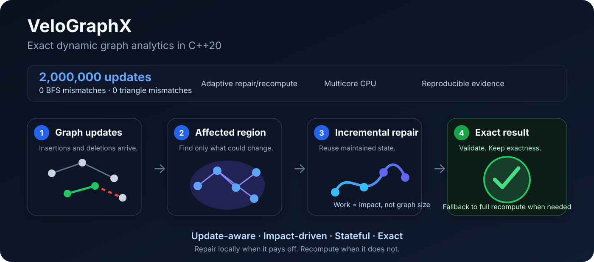
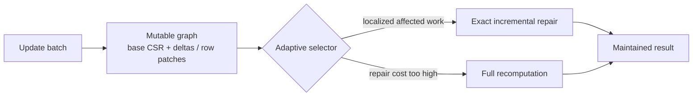

# VeloGraphX

[](https://github.com/sauravsingla/VeloGraphX/actions/workflows/ci.yml)
[](https://github.com/sauravsingla/VeloGraphX/actions/workflows/security.yml)
[](CMakeLists.txt)
[](https://github.com/sauravsingla/VeloGraphX/releases/latest)
[](https://github.com/sauravsingla/VeloGraphX/releases/latest)
[](LICENSE)
[](CITATION.cff)

**Exact dynamic graph analytics in C++20.**

> **Maintain exact graph analytics as your graph changes — repairing affected work when that is cheaper and falling back to full recomputation when it is not.**

VeloGraphX is a C++20 CPU engine for exact analytics on evolving graphs. It combines mutable graph storage, localized incremental maintenance, adaptive repair/recompute decisions, and reproducible systems evaluation.

**2,000,000 updates · 0 BFS mismatches · 0 triangle mismatches**  
**Adaptive repair/recompute · Multicore CPU · Storage-independent algorithms · Reproducible benchmarks**

Engineering quality: **30 CTest targets · Linux/macOS CI · ASan/UBSan · Python 3.9–3.14 packaging**

**Quick links:** [Release](https://github.com/sauravsingla/VeloGraphX/releases/latest) · [Python](python/README.md) · [C++ examples](examples/) · [Architecture](docs/architecture.md) · [Benchmarks](docs/benchmark-methodology.md) · [Security](SECURITY.md) · [Citation](CITATION.cff)

## Try it in 30 seconds

```bash
python -m pip install velographx
```

```python
import velographx as vx

g = vx.Graph(4, False)
updates = vx.UpdateBatch()
updates.add(0, 1)
updates.add(1, 2)
g.apply(updates)

bfs = vx.IncrementalBFS(g, 0)
print(bfs.distances)
```

The Python module uses the same native C++20 engine underneath. Release CI builds and smoke-tests CPython **3.9–3.14** wheels for Linux, Windows, macOS Intel and Apple Silicon, plus a source distribution. See [`python/README.md`](python/README.md) for additional installation paths and API examples.



## Why VeloGraphX?

Dynamic graph systems face a recurring trade-off: repairing only the region affected by an update can be much cheaper than recomputing an answer, but not for every graph, update batch, or algorithm. VeloGraphX makes that trade-off explicit while preserving correctness.

- **Mutable graph storage:** segmented CSR, packed deltas, sparse row patches, forward/reverse adjacency and explicit consolidation.
- **Exact incremental analytics:** maintained state for BFS/unweighted SSSP, weighted SSSP, connected components, triangle count and k-core, with validated localized PageRank maintenance.
- **Adaptive execution:** use affected work and observed cost to choose localized repair or full recomputation instead of assuming incremental execution always wins.
- **Storage-independent algorithms:** graph-access abstractions allow algorithmic paths to work across mutable storage, CSR and foreign graph representations.
- **Auditable evaluation:** correctness gates, pinned datasets and competitors, retained artifacts, timing contracts and explicit negative results.

## When should I use it?

VeloGraphX is designed for workloads where a graph changes over time and analytics must be maintained across updates. Typical settings include evolving network analysis, relationship and fraud graphs, changing knowledge graphs, infrastructure/dependency graphs, and graph-systems research.

If your graph is static, a specialized static CSR engine may be simpler or faster. If approximate answers are acceptable, streaming or approximate graph methods may offer different trade-offs. VeloGraphX focuses on **correctness-preserving analytics under graph mutation and explicit measurement of the repair-vs-recompute crossover**.

## Results at a glance

> GitHub-hosted numbers are **reproducible engineering evidence, not publication-grade hardware claims**.

| Evidence | Verified result |
| --- | --- |
| Dynamic exactness stress | **2,000,000 updates; 0 BFS / 0 triangle mismatches** |
| Adaptive BFS selector | **108/108 exact; 1.66% mean overhead from regime-best** |
| VeloGraphX vs GraphBolt/DZiG | **15.35× / 4.28× / 2.33× faster** on tiny / medium / large hosted update regimes |
| VeloGraphX vs NetworKit vs RisGraph | **91/91 exact; 45 / 27 / 19 raw-policy wins** |
| Dynamic BFS vs NetworKit | `web-Google`: **VeloGraphX ~1.38× faster**; `ca-GrQc`: **NetworKit ~1.35× faster** |
| Static BFS vs GAP / LAGraph | **VeloGraphX fastest** in tested 1T and 4T BFS cases |
| Static SSSP vs GAP / LAGraph | **GAP fastest** in tested 1T and 4T SSSP cases |
| Multicore | BFS **2.74×**, CC **2.50×**, triangles **2.24×** at 4 threads |
| Compression | **3.25×–3.78× smaller**, with a current BFS traversal cost |
| Epinions multi-root BFS vs NetworKit | **3 roots × 5 repetitions exact; VeloGraphX ~1.74× faster** by aggregate mean batch latency (1T hosted campaign) |

The benchmark record intentionally includes both wins and losses. Competitors win some update regimes, GAP is substantially faster on the tested static SSSP workload, CSR remains faster for some full-recompute paths, and compression currently trades traversal speed for memory reduction. The goal is to characterize workload-specific behavior rather than claim a universal performance advantage.

For exact competitor revisions, dataset provenance, raw samples, correctness gates, timing contracts and reproduction instructions, see the [benchmark methodology](docs/benchmark-methodology.md), [competitor benchmarking](docs/competitor-benchmarking.md), and [GraphBolt/DZiG + GAPBS benchmark contract](docs/graphbolt-dzig-gap-benchmark-contract.md).

## Algorithm capabilities

| Algorithm | Full/reference path | Dynamic/incremental path | Correctness contract |
| --- | :---: | :---: | --- |
| BFS / unweighted SSSP | ✓ | ✓ | Exact distances |
| Weighted SSSP | ✓ | ✓ | Exact distances; destructive/increasing-weight updates can fall back to recomputation |
| Connected components | ✓ | ✓ | Exact maintained connectivity |
| Triangle count | ✓ | ✓ | Exact count |
| k-core | ✓ | ✓ | Exact core-number maintenance |
| PageRank | ✓ | ✓ | Localized maintenance with residual/tolerance validation and conservative full fallback |

The implementation also includes SIMD-oriented intersection paths, multicore scheduling, NUMA-aware policies, compression, partition caching and asynchronous partition loading.

## C++ quick start

Source builds require **CMake ≥ 3.20** and a **C++20 compiler**.

```bash
git clone https://github.com/sauravsingla/VeloGraphX.git
cd VeloGraphX
cmake -S . -B build -DCMAKE_BUILD_TYPE=Release
cmake --build build -j
ctest --test-dir build --output-on-failure
./build/velographx_example
./build/velographx_dynamic_example
```

Minimal static API:

```cpp
#include "velographx/algorithms.hpp"

velographx::CsrGraph graph({{0,1}, {1,2}, {2,3}}, false);
auto distance = velographx::bfs_distances(graph, 0);
auto triangles = velographx::triangle_count(graph);
```

Minimal dynamic API:

```cpp
#include "velographx/storage/dynamic_graph.hpp"
#include "velographx/incremental/triangles.hpp"

velographx::DynamicGraph graph(6, false);
velographx::UpdateBatch initial;
initial.add(0, 1);
initial.add(1, 2);
initial.add(2, 0);
graph.apply(initial);

velographx::IncrementalTriangleCount triangles(graph);

velographx::UpdateBatch update;
update.add(2, 3);
triangles.apply(update);

auto current_triangles = triangles.value();
```

For the complete dynamic C++ example, see [`examples/dynamic_transactions.cpp`](examples/dynamic_transactions.cpp).

## Architecture



The storage layer uses **segmented CSR, packed deltas, sparse row-level patches, forward/reverse adjacency, and explicit canonical CSR consolidation** for long-running patch accumulation.

The selector uses **update fraction, affected work, graph scale, root locality and observed cost** to decide when incremental repair is worthwhile. See the [architecture](docs/architecture.md) and [dynamic-storage design](docs/dynamic-storage.md) for implementation details.

## Runtime and systems features

- **Dynamic analytics:** BFS/unweighted SSSP, weighted SSSP, connected components, triangle count, k-core and validated PageRank maintenance.
- **Storage-independent execution:** the graph-access contract supports mutable storage, CSR and foreign graph representations.
- **CPU systems runtime:** multicore execution, SIMD intersections, NUMA-aware policies, compression, partition caching and asynchronous partition loading.
- **C++ engine with Python interface:** native hot paths remain in C++; v0.8.2 provides a standard pip-installable Python distribution and cross-platform release wheels.

## Benchmark and research evidence

The headline results are backed by retained benchmark contracts, pinned datasets and competitors, correctness gates, machine-readable artifacts and explicit claim boundaries.

| Area | Documentation |
| --- | --- |
| Benchmark methodology | [Methodology](docs/benchmark-methodology.md) · [Competitor benchmarking](docs/competitor-benchmarking.md) · [Ablation study](docs/ablation-study.md) |
| Reproduction | [GraphBolt/DZiG + GAPBS contract](docs/graphbolt-dzig-gap-benchmark-contract.md) · [Three-system campaign](docs/three-system-dynamic-bfs-campaign.md) |
| Architecture | [Architecture](docs/architecture.md) · [Dynamic storage](docs/dynamic-storage.md) · [Graph abstraction](docs/graph-abstraction.md) |
| Publication boundary | [Canonical publication campaign](docs/canonical-publication-campaign.md) · [Controlled-hardware execution](docs/controlled-hardware-execution.md) · [Limitations](docs/limitations.md) |
| Python | [Python bindings](python/README.md) |
| Research citation | [`CITATION.cff`](CITATION.cff) |

### Reproduce the 2M-update exactness test

```bash
cmake -S . -B build -DCMAKE_BUILD_TYPE=Release \
  -DVELOGRAPHX_BUILD_TESTS=OFF -DVELOGRAPHX_BUILD_BENCHMARKS=OFF
cmake --build build --target velographx -j 2
c++ -O3 -DNDEBUG -std=c++20 -Iinclude benchmarks/exactness_stress.cpp \
  build/libvelographx.a -pthread -o build/exactness_stress
./build/exactness_stress 2000000 256
```

The default build currently defines **30 CTest targets** plus benchmark executables.

## Evidence boundary

The hosted campaigns establish correctness, reproducibility and crossover behavior, but shared GitHub runners are noisy and hardware can vary. **Controlled-hardware publication tables remain pending.** The canonical campaign is designed for pinned datasets and hardware, **1/2/4/8/16/32-thread scaling, NUMA placement, hardware counters and larger real-world/R-MAT workloads**.

## Project status

VeloGraphX is an **active research and engineering project**. Current library/package version: **0.8.2**. APIs may evolve before 1.0, so pin a version or commit for reproducible experiments.

The **v0.8.2** release adds production-oriented Python packaging, cross-platform wheel builds, source-distribution validation, installed-package smoke tests, and PyPI Trusted Publishing while preserving the C++20 engine and graph-analytics APIs. Research citation metadata is available in [`CITATION.cff`](CITATION.cff).

## Acknowledgments — Technical Feedback

Thanks to [John D. Owens](https://github.com/jowens) (`@jowens`), [Scott Beamer](https://github.com/sbeamer) (`@sbeamer`), [Timothy A. Davis](https://github.com/DrTimothyAldenDavis) (`@DrTimothyAldenDavis`), and [Brian Wheatman](https://github.com/wheatman) (`@wheatman`) for helpful technical and benchmarking feedback that informed the evaluation methodology. Thanks also to Mikhail Kirilin for substantive NetworKit benchmarking feedback.

Their feedback is acknowledged as technical input and does **not** imply endorsement of VeloGraphX or its results.

## Contributing

Contributions are welcome, particularly around **dynamic graph algorithms, CPU optimization, storage policies, benchmark reproducibility, interoperability and documentation**. See [CONTRIBUTING.md](CONTRIBUTING.md) before opening a contribution.

**New to VeloGraphX?** Start with a [good first issue](https://github.com/sauravsingla/VeloGraphX/issues?q=is%3Aissue%20is%3Aopen%20label%3A%22good%20first%20issue%22) or join the [Discussions](https://github.com/sauravsingla/VeloGraphX/discussions) to share a workload, idea or benchmark suggestion.

Apache-2.0 licensed. See [CODE_OF_CONDUCT.md](CODE_OF_CONDUCT.md), [SECURITY.md](SECURITY.md), [Enterprise Security](docs/enterprise-security.md), and [CHANGELOG.md](CHANGELOG.md).